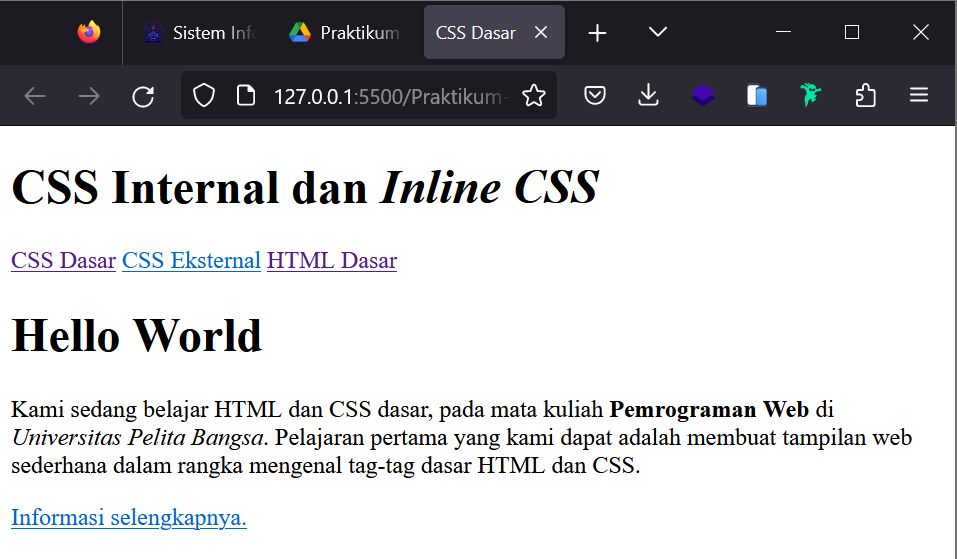

# Lab2Web
# Lab2Web Pemograman web 1
## Pertanyaan dan Tugas
1.Lakukan Eksperimen dengan mengubah dan menambah properti dan nilai pada kode CSS
dengan mengacu pada CSS Cheat Sheet yang diberikan pada file terpisah dari modul ini.

2.Apa perbedaan pendeklarasian CSS elemen h1 {...} dengan #intro h1 {...}? berikan
penjelasannya!

3.Apabila ada deklarasi CSS secara internal, lalu ditambahkan CSS eksternal dan inline CSS pada
elemen yang sama. Deklarasi manakah yang akan ditampilkan pada browser? Berikan
penjelasan dan contohnya!

4.Pada sebuah elemen HTML terdapat ID dan Class, apabila masing-masing selector tersebut
terdapat deklarasi CSS, maka deklarasi manakah yang akan ditampilkan pada browser?
Berikan penjelasan dan contohnya! `( <p id="paragraf-1" class="text-paragraf"> )`

Jawaban 

2.Pada pendeklarasian CSS elemen h1 {..}  itu mengacu pada semua tag elemen h1 yang ada pada file html sedangkan
#intro h1 {..} itu  mengacu pada elemen ber id = intro, karena symbol (#) untuk id

3.Ketiga dari deklarasi tersebut bisa ditampilkan di browser

.png)

4.Kedua deklarasi dari id dan class bisa ditampilkan. Gambarnya ada di atas

## Praktikum ke 2 
* Membuat Code Untuk Dokumen HTML


* Jika saya running hasilnya akan seperti ini


* Mendeklarasikan CSS Internal Pada Head Dokumen


* Jika saya running hasilnya kana seperti ini


* Menambahkan Inline CSS pada tag `<p>`
`<p style="text-align: center; color: #ccd8e4;">`


* Membuat CSS Eksternal dengan nama style_eksternal.css

* Kemudian tambahkan tag `<link>` untuk menghubungkan ke CSS
```
<head>
<!-- menyisipkan css eksternal -->
<link rel="stylesheet" href="style_eksternal.css" type="text/css">
</head>
```
* Hasilnya seperti ini


* Menambahkan CSS Selector ID dan Class pada file style_eksternal.css


* Hasilnya akan seperti ini
